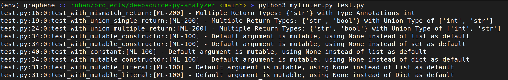

# MyLinter 🔍


Mylinter catches 2 types of issues:

## 1. Multiple Constant Return Type 

Analyzer to catch multiple function with multiple return type 

```
def sample_func(value):
    if value == 'Admin':
        return 1 
    return 'Access Denied'
```
### Why?

Since Python supports multiple return type, it is important to ensure that the function always return the same type of value hinted in type annotation. This is because the type of value returned by a function can affect the behavior of the program. 

### Cases that the checker will work 

1. Function with mismatch return type 
```
def test_with_mismatch_return()->int:
    return '2'

def test_with_union()->Union[int,bool]:
    if 1 > 0:
        return '2'
    return 2.0
```

2. Function with multiple return type 

```
def test_with_union_multiple_return(value)->Union[int,str]:
    if value == 'Admin':
        return True
    return 'Access Denied' 
```


## 2. Mutable Default Args 

Analyzer to catch incorrect default arg, like using mutable instead of constant or none

```
def sample_func(value=[]):
    value.append(2)
    return 'True'

sample_func()
sample_func()
sample_func()

print(sample_func.__defaults__)
>>> ([2, 2, 2],)
```

### Why?

In Python, default arguments are stored at the time the function is defined, not when it’s called. When you define a function with default arguments, Python evaluates the default argument expressions and binds the resulting objects to the function’s bytecode object.

If the default argument is a mutable object like a list, dictionary, or set, it can lead to unexpected behavior because the same object is used for every call to the function.

### Cases that the checker will work 

1. Function with mutable default arg

```
def test_with_mutable_literal(l=[], s={}):
    pass

def test_with_mutable_constructor(l=list(), s=set(), d=dict()):
    pass
```


## How to Run?

1. Setup python environment 

```
python3.10 -m venv venv
source venv/bin/activate
pip install -r requirements.txt
```

2. Run the checker on a file 

```
python mylinter.py test.py

```


## Results 





## Tests 

```
pytest unit_test.py
```